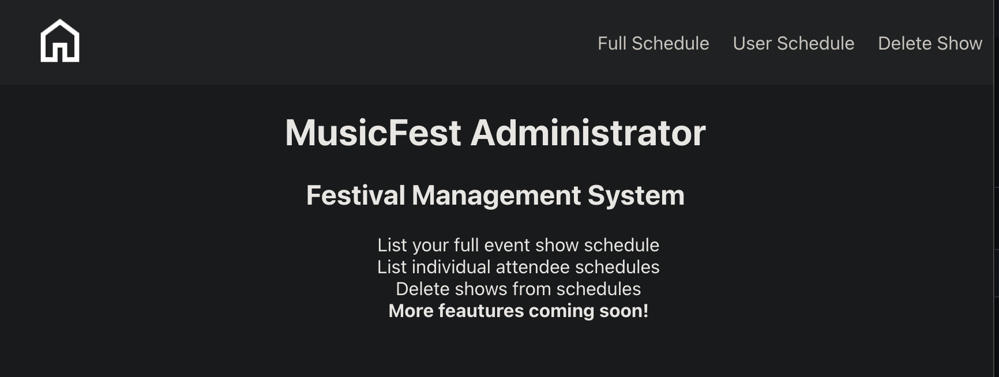

# MusicFest Administrator (Front End)

## Preview

MusicFest Administrator is a tool to help people running music festivals.  It allows you to get a full list/schedule of all performing acts, a schedule for a specific attendee, and to delete artists from specific schedule slots.

## Navigation

Use the navbar across the top of the page to visit the different screens.
- The home icon will return you to the home page from any screen
- Full Schedule - Loads the entire Music Festival schedule from the database.
- User Schedule - Will prompt for a user id and load the schedule for that user.
- Delete Show - Will delete an artists show from a specic schedule by id.

### Deployed Site
- Coming soon!

## Getting Started
Clone down the resposity to your local machine, cd into the direcotry and run: 
- npm install

To see the front end application functioning from the command line run:
- npm start

This will allow you to use to load the website and navigate between the screens however no data will be displayed and none of the functions will work unless you also clone down the backend, install it, and run the backend server.

### Technology Used
- React v19.0
- React Router v7.1

### Prerequisites
To use the user login functionality you will be required to have the [MusicFest Administrator Backend Repo](https://github.com/MiTOBrien/musicfest_administrator_be) installed and running.

## Test Suite
End to End testing was done with Cypress.  To run the test suite you will need to install Cypress with: 
- npm i -D cypress

Then update your package.json file by adding: "cypress": "cypress open" to your "scripts" section.

To run Cypress from the command line type: 
- npm run cypress

## Contributors
- Michael O'Brien [github](https://github.com/MiTOBrien) [LinkedIn](https://www.linkedin.com/in/michaelobrien67/)